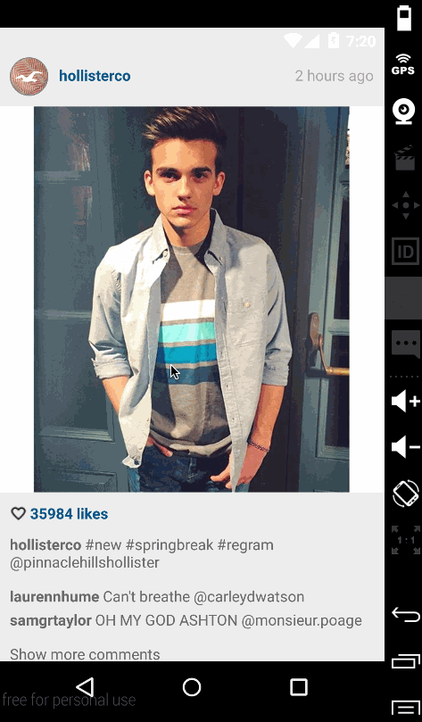

# Popular Photos (Instagram Client)

- Android Codepath
- Assignment 1
- Due Sunday, February 7, 2016

This application retrieves popular photos from Instagram and displays them to the user in a similar
interface as the real Instagram app. 

Time spent: 10 hours

Completed user stories:

 * (required): Graphic, Caption, Username for each photo (2 points) 
 * Relative timestamp, like count, user profile image for each photo (3 points)
 * Add pull-to-refresh for popular stream with SwipeRefreshLayout (1 point)
 * Show latest comment for each photo (bonus: show last 2 comments) (1 point + 1 bonus)
 * Display each user profile image using a RoundedImageView (2 points)
 * Display a nice default placeholder graphic for each image during loading (read more about Picasso) (1 point)
 * Improve the user interface through styling and coloring (1 to 5 points)
 * Allow user to view all comments for an image within a separate activity or dialog fragment (3 points)
 * Apply the popular Butterknife annotation library to reduce view boilerplate. (1 point)

Walkthrough of all user stories:

GIF created with [LiceCap](http://www.cockos.com/licecap/).
